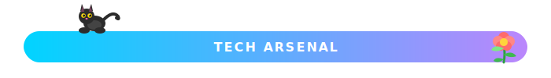

<!-- ═══════════════════════════════════════════════════════════════════════ -->
<!-- ░░░░░░░░░░░░░░░░░░░░░░░░ HEADER ░░░░░░░░░░░░░░░░░░░░░░░░░░░░░░░░░░ -->
<!-- ═══════════════════════════════════════════════════════════════════════ -->

<a href="https://github.com/jhm1909">
  
</a>

<!-- ═══════════════════════════════════════════════════════════════════════ -->
<!-- ░░░░░░░░░░░░░░░░░░░░░░ TYPING SVG ░░░░░░░░░░░░░░░░░░░░░░░░░░░░░░░░ -->
<!-- ═══════════════════════════════════════════════════════════════════════ -->

<p align="center">
  <a href="https://github.com/jhm1909">
    
  </a>
</p>

<!-- ═══════════════════════════════════════════════════════════════════════ -->
<!-- ░░░░░░░░░░░░░░░░░░░░░░ ABOUT ME ░░░░░░░░░░░░░░░░░░░░░░░░░░░░░░░░░░ -->
<!-- ═══════════════════════════════════════════════════════════════════════ -->

<p align="center">
  
</p>

<p align="center">
  
</p>

<table align="center">
  <tr>
    <td>

```js
const cappy = {
  role: "Full-Stack Developer",
  location: "Seoul, South Korea",
  code: ["Go", "TypeScript", "JavaScript", "Python"],
  focus: "Scalable Backend & Modern Frontend",
  currentlyBuilding: "Production-grade Go systems",
  learning: "System Design & Cloud Architecture",
  askMeAbout: ["Go", "APIs", "Microservices", "React"],
  funFact: "I debug faster with coffee in hand"
};
```

  </td>
  </tr>
</table>

<p align="center">
  <a href="mailto:jeonghamin1909@gmail.com">
    
  </a>
</p>

<!-- ═══════════════════════════════════════════════════════════════════════ -->
<!-- ░░░░░░░░░░░░░░░░░░░░░ TECH STACK ░░░░░░░░░░░░░░░░░░░░░░░░░░░░░░░░░ -->
<!-- ═══════════════════════════════════════════════════════════════════════ -->


<p align="center">
  
</p>

<table align="center">
  <tr>
    <td align="center" width="120"><b>Languages</b></td>
    <td align="left">
      
    </td>
  </tr>
  <tr>
    <td align="center"><b>Frontend</b></td>
    <td align="left">
      
    </td>
  </tr>
  <tr>
    <td align="center"><b>Backend</b></td>
    <td align="left">
      
    </td>
  </tr>
  <tr>
    <td align="center"><b>DevOps</b></td>
    <td align="left">
      
    </td>
  </tr>
  <tr>
    <td align="center"><b>Tools</b></td>
    <td align="left">
      
      <br/>
      <a href="https://docs.claude.com/en/docs/claude-code/overview"></a>
      <a href="https://antigravity.google/"></a>
      <a href="https://cursor.com/"></a>
      <a href="https://github.com/features/copilot"></a>
    </td>
  </tr>
</table>

<br/>

<!-- ═══════════════════════════════════════════════════════════════════════ -->
<!-- ░░░░░░░░░░░░░░░░░░░░ GITHUB STATS ░░░░░░░░░░░░░░░░░░░░░░░░░░░░░░░░ -->
<!-- ═══════════════════════════════════════════════════════════════════════ -->

<p align="center">
  
</p>

<table align="center">
  <tr>
    <td>
      <a href="https://github.com/jhm1909">
        
      </a>
    </td>
    <td>
      <a href="https://github.com/jhm1909">
        
      </a>
    </td>
  </tr>
</table>

<br/>

<table align="center">
  <tr>
    <td align="center" width="50%">
      <a href="https://github.com/jhm1909">
        
      </a>
    </td>
    <td align="center" width="50%">
      <a href="https://github.com/jhm1909">
        
      </a>
    </td>
  </tr>
</table>

<br/>

<p align="center">
  <a href="https://wakatime.com/@cappy">
    
  </a>
</p>

<br/>


<!-- ═══════════════════════════════════════════════════════════════════════ -->
<!-- ░░░░░░░░░░░░░░░░░░ 3D CONTRIBUTION ░░░░░░░░░░░░░░░░░░░░░░░░░░░░░░░ -->
<!-- ═══════════════════════════════════════════════════════════════════════ -->

<p align="center">
  
</p>

<p align="center">
  <a href="https://github.com/jhm1909">
    
  </a>
</p>

<br/>

<!-- ═══════════════════════════════════════════════════════════════════════ -->
<!-- ░░░░░░░░░░░░░░░░░░░░░ CONNECT ░░░░░░░░░░░░░░░░░░░░░░░░░░░░░░░░░░░░ -->
<!-- ═══════════════════════════════════════════════════════════════════════ -->

<p align="center">
  
</p>

<p align="center">
  <a href="mailto:jeonghamin1909@gmail.com">
    
  </a>
  &nbsp;
  <a href="https://github.com/jhm1909">
    
  </a>
  &nbsp;
  <a href="https://github.com/jhm1909?tab=repositories">
    
  </a>
</p>

<p align="center">
  <i>💬 Open to collaboration on Go backend, distributed systems, and developer tooling</i>
</p>

<p align="center">
  
</p>

<br/>

<!-- ═══════════════════════════════════════════════════════════════════════ -->
<!-- ░░░░░░░░░░░░░░░░░░░░░░ FOOTER ░░░░░░░░░░░░░░░░░░░░░░░░░░░░░░░░░░░░ -->
<!-- ═══════════════════════════════════════════════════════════════════════ -->


