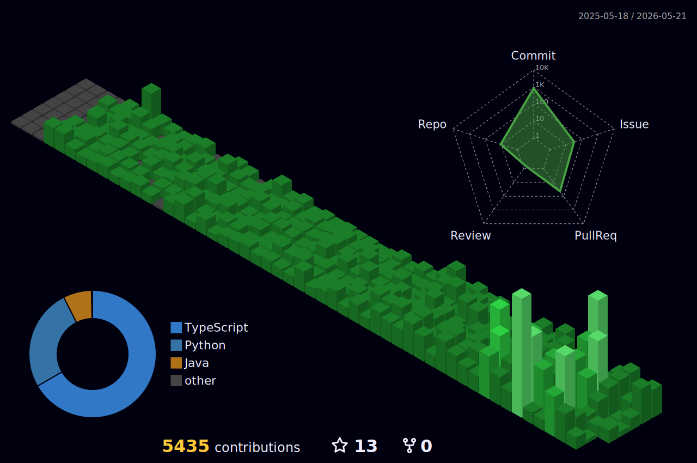

<!-- ═══════════════════════════════════════════════════════════════════════ -->
<!-- ░░░░░░░░░░░░░░░░░░░░░░░░ HEADER ░░░░░░░░░░░░░░░░░░░░░░░░░░░░░░░░░░ -->
<!-- ═══════════════════════════════════════════════════════════════════════ -->


<!-- ═══════════════════════════════════════════════════════════════════════ -->
<!-- ░░░░░░░░░░░░░░░░░░░░░░ TYPING SVG ░░░░░░░░░░░░░░░░░░░░░░░░░░░░░░░░ -->
<!-- ═══════════════════════════════════════════════════════════════════════ -->

<p align="center">
  <a href="https://github.com/jhm1909">
    
  </a>
</p>

<!-- ═══════════════════════════════════════════════════════════════════════ -->
<!-- ░░░░░░░░░░░░░░░░░░░░ PROFILE VIEWS ░░░░░░░░░░░░░░░░░░░░░░░░░░░░░░░ -->
<!-- ═══════════════════════════════════════════════════════════════════════ -->

<p align="center">
  
  
  
</p>

<br/>

<!-- ═══════════════════════════════════════════════════════════════════════ -->
<!-- ░░░░░░░░░░░░░░░░░░░░░░ ABOUT ME ░░░░░░░░░░░░░░░░░░░░░░░░░░░░░░░░░░ -->
<!-- ═══════════════════════════════════════════════════════════════════════ -->

<p align="center">
  
</p>

<a href="https://spotify-github-profile.kittinanx.com/api/view?uid=31lkmwj7oxs7si5ntnuxhaxklysi&redirect=true">
  
</a>

```js
const capy = {
  role: "Full-Stack Developer",
  code: ["Go", "TypeScript", "JavaScript", "Python"],
  focus: "Scalable Backend Systems & Modern Frontend",
  currentlyBuilding: "Production-grade systems with Go",
  learning: "System Design & Cloud Architecture",
  askMeAbout: ["Go", "APIs", "Microservices", "React"],
  funFact: "I debug faster with ☕ in hand"
};
```

<p>
  <a href="mailto:jeonghamin1909@gmail.com">
    
  </a>
</p>

<br clear="both"/>

<!-- 🐱 Cat divider 1: Coding cat -->
<p align="center">
  
</p>

<!-- ═══════════════════════════════════════════════════════════════════════ -->
<!-- ░░░░░░░░░░░░░░░░░░░░░ TECH STACK ░░░░░░░░░░░░░░░░░░░░░░░░░░░░░░░░░ -->
<!-- ═══════════════════════════════════════════════════════════════════════ -->

<p align="center">
  
</p>

<p align="center">
  <a href="https://skillicons.dev">
    
  </a>
</p>

<br/>

<!-- 🐱 Cat divider 2: Curious cat -->
<p align="center">
  
</p>

<!-- ═══════════════════════════════════════════════════════════════════════ -->
<!-- ░░░░░░░░░░░░░░░░░░░░ GITHUB STATS ░░░░░░░░░░░░░░░░░░░░░░░░░░░░░░░░ -->
<!-- ═══════════════════════════════════════════════════════════════════════ -->

<p align="center">
  
</p>

<p align="center">
  <a href="https://github.com/jhm1909">
    
  </a>
</p>

<br/>

<!-- ═══════════════════════════════════ STREAK STATS ═══════════ -->

<p align="center">
  <a href="https://github.com/jhm1909">
    
  </a>
</p>

<br/>

<!-- 🐱 Cat divider 3: Dancing cat -->
<p align="center">
  
</p>

<!-- ═══════════════════════════════════════════════════════════════════════ -->
<!-- ░░░░░░░░░░░░░░░░░░░░░ TROPHIES ░░░░░░░░░░░░░░░░░░░░░░░░░░░░░░░░░░░ -->
<!-- ═══════════════════════════════════════════════════════════════════════ -->

<p align="center">
  
</p>

<p align="center">
  <a href="https://github.com/ryo-ma/github-profile-trophy">
    
  </a>
</p>

<br/>

<!-- 🐱 Cat divider 4: Cat with yarn -->
<p align="center">
  
</p>

<!-- ═══════════════════════════════════════════════════════════════════════ -->
<!-- ░░░░░░░░░░░░░░░░░░░ ACTIVITY GRAPH ░░░░░░░░░░░░░░░░░░░░░░░░░░░░░░░ -->
<!-- ═══════════════════════════════════════════════════════════════════════ -->

<p align="center">
  
</p>

<p align="center">
  <a href="https://github.com/jhm1909">
    
  </a>
</p>

<br/>

<!-- 🐱 Cat divider 5: Sleepy cat -->
<p align="center">
  
</p>

<!-- ═══════════════════════════════════════════════════════════════════════ -->
<!-- ░░░░░░░░░░░░░░░░░░░░ SNAKE GRAPH ░░░░░░░░░░░░░░░░░░░░░░░░░░░░░░░░░ -->
<!-- ═══════════════════════════════════════════════════════════════════════ -->

<p align="center">
  
</p>

<p align="center">
  <picture>
    <source media="(prefers-color-scheme: dark)" srcset="https://raw.githubusercontent.com/jhm1909/jhm1909/output/github-snake-dark.svg" />
    <source media="(prefers-color-scheme: light)" srcset="https://raw.githubusercontent.com/jhm1909/jhm1909/output/github-snake.svg" />
    
  </picture>
</p>

<br/>

<!-- 🐱 Cat divider 6: Jumping cat -->
<p align="center">
  
</p>

<!-- ═══════════════════════════════════════════════════════════════════════ -->
<!-- ░░░░░░░░░░░░░░░░░░ 3D CONTRIBUTION ░░░░░░░░░░░░░░░░░░░░░░░░░░░░░░░ -->
<!-- ═══════════════════════════════════════════════════════════════════════ -->

<p align="center">
  
</p>

<p align="center">
  <a href="https://github.com/jhm1909">
    
  </a>
</p>

<br/>

<!-- 🐱 Cat divider 7: Cat typing -->
<p align="center">
  
</p>

<!-- ═══════════════════════════════════════════════════════════════════════ -->
<!-- ░░░░░░░░░░░░░░░░░░░░░ METRICS ░░░░░░░░░░░░░░░░░░░░░░░░░░░░░░░░░░░░ -->
<!-- ═══════════════════════════════════════════════════════════════════════ -->

<p align="center">
  
</p>

<p align="center">
  <a href="https://github.com/jhm1909">
    
  </a>
</p>

<p align="center">
  
  
</p>

<p align="center">
  
  
</p>

<br/>

<!-- 🐱 Cat divider 8: Cat wave -->
<p align="center">
  
</p>

<!-- ═══════════════════════════════════════════════════════════════════════ -->
<!-- ░░░░░░░░░░░░░░░░░░░░░ CONNECT ░░░░░░░░░░░░░░░░░░░░░░░░░░░░░░░░░░░░ -->
<!-- ═══════════════════════════════════════════════════════════════════════ -->

<p align="center">
  
</p>

<p align="center">
  <a href="mailto:jeonghamin1909@gmail.com">
    
  </a>
  <a href="https://github.com/jhm1909">
    
  </a>
</p>

<br/>

<!-- ═══════════════════════════════════════════════════════════════════════ -->
<!-- ░░░░░░░░░░░░░░░░░░ QUOTE ░░░░░░░░░░░░░░░░░░░░░░░░░░░░░░░░░░░░░░░░ -->
<!-- ═══════════════════════════════════════════════════════════════════════ -->

<p align="center">
  
</p>

<br/>

<!-- ═══════════════════════════════════════════════════════════════════════ -->
<!-- ░░░░░░░░░░░░░░░░░░░░░░ FOOTER ░░░░░░░░░░░░░░░░░░░░░░░░░░░░░░░░░░░░ -->
<!-- ═══════════════════════════════════════════════════════════════════════ -->

<p align="center">
  
  
  <b> Thanks for visiting! Have a purrfect day! 🐱 </b>
  
  
</p>


